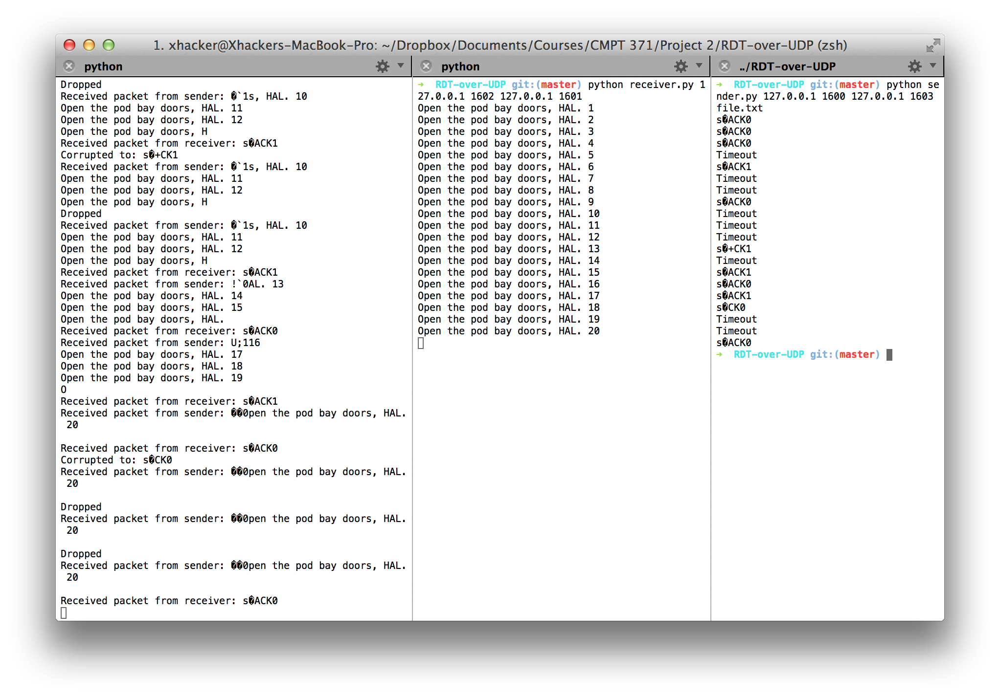

# RDT Over UDP

A simple implementation of RDT (Reliable Data Transfer) 3.0.  
You need to run in correct order: interceptor, receiver, then sender.



## Interceptor
25% of packets will be dropped. Another 25% of packets will be corrupted by randomly changing one byte. You can change the percentage by editing **intercepter.py**.
```bash
Usage: python interceptor.py FromSenderPort ToReceiverPort FromReceiverPort ToSenderPort
python interceptor.py 1600 1601 1602 1603
```

## Receiver
```bash
python receiver.py 127.0.0.1 1602 127.0.0.1 1601
```

## Sender
```bash
python sender.py 127.0.0.1 1600 127.0.0.1 1603 file.txt
```
